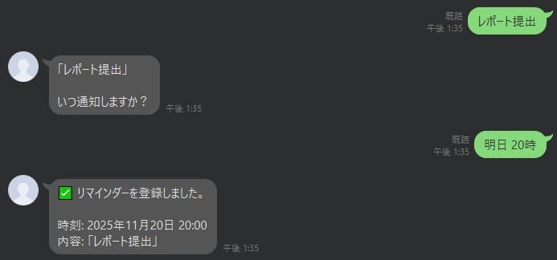
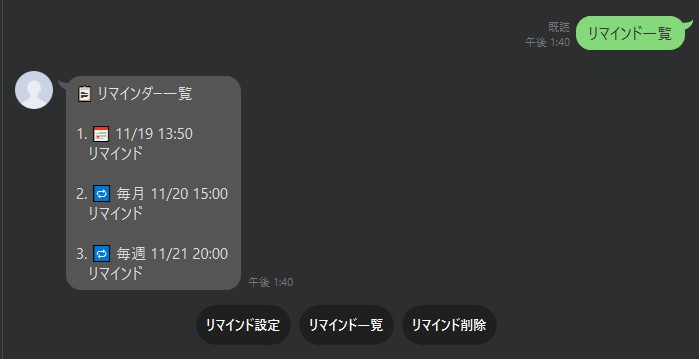
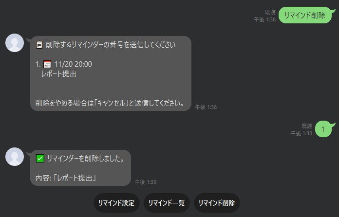

# Reminder Bot

LINEで自然な日本語でリマインダーを登録・管理できるボットです。リマインくんは便利だが、個人情報を送るのが怖い・セルフホストしたいという方にオススメです。

## 何ができる？

LINEのトーク画面で「明日9時に課題提出」と送るだけで、リマインダーを登録できます。

- 日本語の自然な時間指定に対応（「10分後」「明日9時」「毎週月曜 20時」など）
- QuickReplyボタンで簡単操作
- 一度きり・毎週・毎月のリマインダーに対応
- セルフホスト型（自分のサーバーで動作）

## 使い方

### リマインダーを登録する


1. **ボットにメッセージを送る**
   例: 「課題を提出する」

2. **時間を指定する**
   ボットが「いつ通知しますか？」と聞いてくるので、時間を送信
   例: 「明日9時」

3. **完了！**
   指定した時間にLINEで通知が届きます

### リマインダーを確認する


「**リマインド一覧**」と送信すると、登録中のリマインダーが表示されます。

### リマインダーを削除する


「**リマインド削除**」と送信すると、削除したいリマインダーの番号を選択できます。

- 個別削除: 番号を送信（例: 「1」）
- 一括削除: 「すべてを削除」を選択

### 時間指定の例

**相対的な時間**:
- `10分後`
- `2時間後`
- `3日後`

**絶対的な時間**:
- `22:00` / `14時` / `午後3時`

**日付 + 時間**:
- `今日の22:00`
- `明日 9時`
- `明後日 午後3時`
- `2025年5月3日 14:00`
- `11/20` （11月20日 9:00）

**繰り返し**:
- `毎週日曜日 20時`
- `毎月1日 20時`

### QuickReplyボタン

ボットの返信には以下のボタンが表示されます:

- **リマインド設定**: 新しいリマインダーを登録
- **リマインド一覧**: 登録中のリマインダーを確認
- **リマインド削除**: リマインダーを削除

## セットアップ

### 必要なもの

- Python 3.10以上
- LINE Messaging API アカウント（Channel Access Token と Channel Secret）
- Ubuntuサーバー（または同等のLinux環境）
- LINEウェブフック用の公開HTTPS エンドポイント

### インストール

1. リポジトリをクローン:
   ```bash
   git clone https://github.com/kmch4n/Reminder
   cd Reminder
   ```

2. 依存関係をインストール:
   ```bash
   pip install -r requirements.txt
   ```

3. 環境変数を設定:
   ```bash
   cp .env.example .env
   # .env を編集してLINEの認証情報を追加
   ```

4. データディレクトリを作成:
   ```bash
   mkdir -p data
   ```

### 環境変数

`.env` ファイルで以下を設定:

- `LINE_CHANNEL_ACCESS_TOKEN`: LINEチャネルアクセストークン
- `LINE_CHANNEL_SECRET`: LINEチャネルシークレット
- `REMINDER_PUBLIC_URL`（任意）: ウェブフックの公開URL（デフォルト: `https://your-domain.com/reminder/callback`）
- `REMINDER_DATA_DIR`（任意）: データディレクトリのパス（デフォルト: `./data`）
- `REMINDER_TIMEZONE`（任意）: タイムゾーン（デフォルト: `Asia/Tokyo`）

### 起動

**ウェブフックサーバーを起動**:
```bash
python receive.py
```

**スケジューラーを起動**:
```bash
python send.py
```

本番環境では `send.py` を systemd サービスまたは cron で実行することを推奨します。
